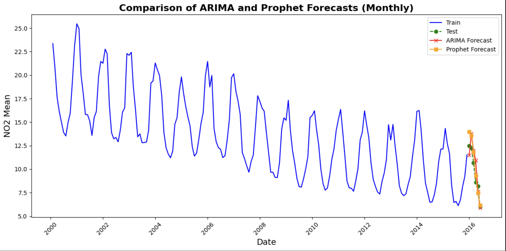

# Air_Pollution_Forcasting_using_Time_Series

This project demonstrates a comprehensive time series analysis and forecasting workflow using the US Pollution dataset from Kaggle. The primary focus is on the NO₂ (Nitrogen Dioxide) pollutant, aggregated to a monthly level. Two forecasting approaches are employed:

ARIMA (Auto-Regressive Integrated Moving Average)
Prophet (Facebook’s time series forecasting library)
By following this repository, you’ll learn how to preprocess and explore the data, check for stationarity, decompose the time series, fit forecasting models, and evaluate model performance.

Project Overview
Goal: Forecast monthly NO₂ levels in the United States using historical data from 2000 to 2016.
Techniques:
Time series decomposition (trend, seasonality).
Stationarity check via Augmented Dickey-Fuller (ADF).
Manual ARIMA modeling with seasonal differencing.
Prophet forecasting.
Model comparison (MSE, MAE).
Interactive visualization with Plotly.

Dataset Description
The US Pollution dataset contains daily pollutant levels (NO₂, SO₂, O₃, CO) across multiple states and counties in the United States from 2000 to 2016. In this project, we focus on NO₂ measurements. We aggregate daily data into monthly averages to simplify and speed up model training.

Key Columns:

Date.Local (converted to datetime)
NO2.Mean (daily average, aggregated monthly)

Prerequisites and Environment
Python 3.7+
Key libraries:
pandas
numpy
matplotlib
seaborn (optional for additional plotting)
statsmodels (for ARIMA and time series analysis)
pmdarima (optional, if you experiment with auto_arima)
prophet (for Prophet model)
plotly (for interactive plots)
scikit-learn (for error metrics)

Key Steps in the Analysis
Data Loading & Cleaning

Load the CSV file into a pandas DataFrame.
Convert date columns to datetime.
Handle missing values (e.g., interpolation, dropping).
Data Aggregation

Resample daily data to monthly averages.
Exploratory Data Analysis

Plot NO₂ levels over time.
Check for outliers (IQR method).
Visualize seasonal trends with boxplots.
Stationarity & Decomposition

Apply the Augmented Dickey-Fuller test.
Decompose the time series into trend, seasonal, and residual components.
Modeling

ARIMA:
Use monthly data with seasonal_order=(0,1,0,12) to capture yearly seasonality.
Check residuals with ACF plots and Ljung-Box tests.
Prophet:
Fit Prophet model with yearly seasonality.
Generate future dates and forecast monthly NO₂ levels.
Forecasting & Evaluation

Compare the forecasts with the test set (last 6 months).
Use MSE (Mean Squared Error) and MAE (Mean Absolute Error) for evaluation.
Visualization

Line plots showing train, test, and forecast values.
Interactive Plotly plots for dynamic exploration.
Results
Stationarity: ADF test indicates the monthly series is stationary (p-value < 0.05).
ARIMA:
MSE: ~1.85
MAE: ~1.16
The residuals suggest some autocorrelation (as shown by the Ljung-Box test), so further model tuning may be possible.
Prophet:
Provides a similar forecast pattern for the test period.
Yearly seasonality is clearly visible in the decomposition plots.
The comparison plot shows that both models capture the downward trend and seasonal pattern. However, ARIMA and Prophet may diverge slightly in the final months.

Next Steps and Improvements
Further Hyperparameter Tuning:
Experiment with different ARIMA orders and Prophet seasonality parameters to improve forecast accuracy.
Exogenous Variables:
Incorporate weather data (temperature, wind speed, etc.) or other relevant features to enhance the model.
Multi-Pollutant Analysis:
Extend the same workflow to other pollutants (SO₂, O₃, CO) for a more comprehensive study.
Deployment:
Wrap the forecasting logic into a web application or API (e.g., Flask, Streamlit, or a Docker container).
